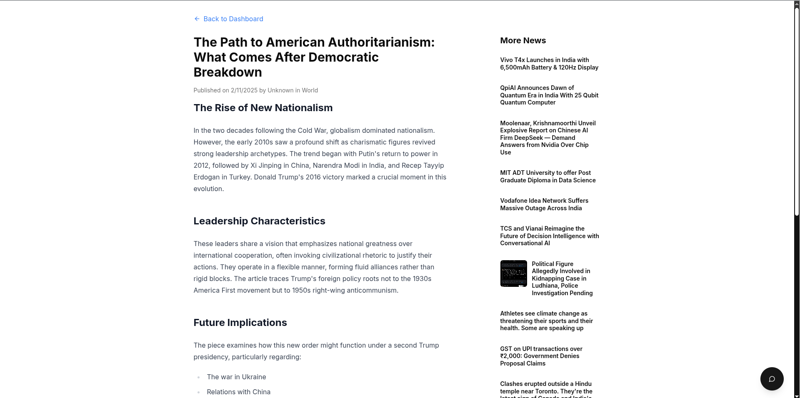
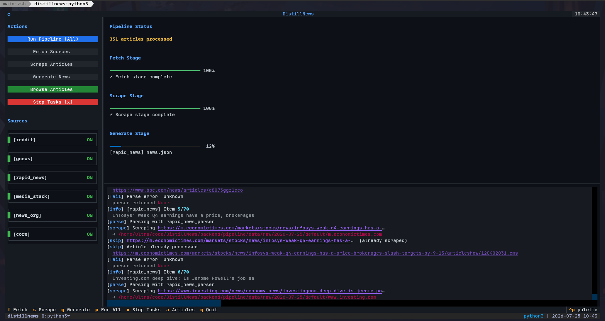

# Distill News : AI-Powered Community News Aggregation Platform

Distill News is an automated news aggregation and synthesis platform powered by AI multi-agents. Its goal is to crawl, aggregate, filter, and summarize news across the internet—ranging from mainstream news APIs to public community forums—presenting content in a clean, structured, and personalized format.

## Introduction

### The Problem

Traditional news outlets often fail to cover everything due to profit motives, regional biases, and limited workforce resources. Meanwhile, public forums and social platforms like Reddit or X overflow with real-time updates and grassroots stories, but lack a unified, noise-free platform for reader consumption.

### The Solution

Distill News uses AI agents to extract core news from web scraping, trusted APIs, and real-time community sources. The platform strips away clickbait, ads, and filler, rewriting posts into concise, professional-grade news articles.

By combining structured AI extraction, community discovery, and smart personalization, Distill News provides direct access to reliable local and global updates—without clickbait, corporate spin, or media gatekeeping.

### Demo

🎬 [Watch Demo Video](https://youtu.be/DAjnclylWJI?si=9GWWL3lOncghZvmW)





---

## Key Features

- **AI-Generated News Feed:** Aggregates content from news APIs (GNews, MediaStack, RapidAPI) and community platforms like Reddit.
- **Noise & Fluff Filtering:** Automatically removes clickbait, advertisements, duplicates, and filler content.
- **Multi-Agent Processing:** Classifies incoming data, extracts key metadata (title, summary, date, location), and formats news into clean markdown.
- **Personalized Recommendations:** Learns from user reading time and interests, adapting story selection dynamically using topic-weighted preferences.
- **RAG-based AI Assistant:** Includes context from articles, supports session memory for follow-up questions, and handles both local and global news queries conversationally.
- **Newsletter & Newspaper Views:** Generates curated email digests and a digital print-style newspaper layout.

---

## Getting Started

### Fast Local Development (Hot-Reloading)

For instant sub-second hot-reloading without Docker container builds:

```bash
./dev.sh
```

This starts `mongo` & `redis` in Docker background and runs the backend & embedding server locally with auto-reload.

### Full Docker Deployment (Production VM / VPS)

The platform deploys 3 core application containers (`frontend`, `backend`, `embedding-server`) alongside `mongo` and `redis`. Minimum system requirement: **2 vCPU, 4GB RAM, 30GB Disk**.

1. **Configure Swap Space (Recommended for 4GB RAM VMs):**
   ```bash
   sudo fallocate -l 4G /swapfile && sudo chmod 600 /swapfile && sudo mkswap /swapfile && sudo swapon /swapfile
   ```

2. **Build and Start Production Stack:**
   ```bash
   docker compose up -d --build
   ```

*Note: `Dockerfile.embedding` uses CPU-only PyTorch to keep image size lightweight (~1.5GB).*

### Pipeline TUI

To use the pipeline, run:

```bash
python3.13 -m venv venv
source venv/bin/activate
pip install -r requirements-pipelines.txt
./cli.py
```

### System Documentation Suite

For detailed architecture and subsystem documentation, refer to the documentation suite in [`doc/`](doc/):

- 🏗️ **[System Architecture](doc/ARCHITECTURE.md)** — High-level architecture, container topology, unified embedding microservice.
- 🎨 **[Frontend Documentation](doc/FRONTEND.md)** — Next.js 14 App Router, components (`HeadlinesBanner`, `ChatFab`), and LocalStorage feature flags.
- ⚡ **[FastAPI Web Server](doc/SERVER.md)** — REST API routes, authentication, database handles, and weather proxy.
- 🤖 **[RAG & Chatbot Subsystem](doc/RAG_CHATBOT.md)** — Conversational QA, vector search, and unified embedding integration.
- ⚙️ **[Ingestion Pipeline & TUI](doc/AGENT_PIPELINE.md)** — Scrapers, LLM extraction pipeline, Textual TUI dashboard, and CLI runner.

---

## Contributors

Originally created during **Hack36** in 36 hour hackathon.
Refactored an year later for maintainability.

**Team:** `SNAP_back_to_reality`

- [Shivam Aryan](https://github.com/Aryan10)
- [Nishant Mohan](https://github.com/Nishant040305)
- [Poojan Kothari](https://github.com/techguy940)
- [Shaurya Singh](https://github.com/shauryasf)

```

```
